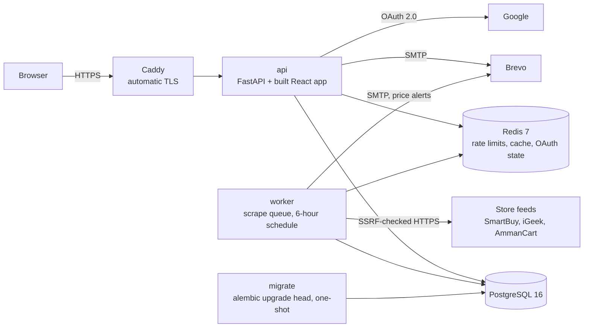

# Ahsan Se3r (احسن سعر)

A Jordanian price-comparison site that recognises the same phone, laptop or
monitor across stores that each name it differently, and ranks every result as
an exact, close or similar match, with the reason why.

**Live: https://ahsanse3r.com** (Arabic by default, right-to-left, with an
English toggle)

FastAPI · SQLAlchemy · Alembic · PostgreSQL · Redis · React · Vite · Tailwind ·
Docker Compose · Caddy, on one Hetzner VPS.

## What it does

A shopper types a specific product, such as `iPhone 15 128GB Black` or the same
query in Arabic, `ايفون ١٥ ١٢٨ جيجا اسود`. The results come back in three tiers:

| Tier | Score | Meaning |
|---|---|---|
| **Exact** | 100 | Everything the shopper asked for |
| **Close** | 85–99 | Same product, a minor detail differs (usually colour) |
| **Similar** | 70–84 | Related, but a detail that changes the product differs (storage, variant) |

Every result states which attribute differed and what the two values were. The
product page lists each store's current price with delivery, a link to the
store, when the price was last checked, and the price history.

Prices come from two sources. Three online stores are read automatically:
SmartBuy, iGeek Megastore and AmmanCart. The second source is shops that have
no website: they register as merchants and enter their own prices, and
shoppers contact them by phone or WhatsApp. That is why there is no checkout.

### The problem: one product, many names

These titles were copied from the live store feeds into `backend/tests/`:

| Store | As the store writes it | What makes it hard |
|---|---|---|
| SmartBuy | `Xiaomi Redmi A7 Pro 4G, 4GB & 64GB, 6.9Inch, 6000Mah, Black` | Two capacities, neither labelled as memory or storage |
| SmartBuy | `Honor X7e Plus 5G, 8GB & 256GB, 6.8Inch, 8100MAh, Meteor Grey` | Letter-and-digit model code, decorated colour name |
| AmmanCart | `Redmi Note 15 Pro+ 5G` | No brand. SmartBuy writes `Xiaomi Redmi …` |
| AmmanCart | `oppo Smart Phones A5 PRO 5G` | Filler between brand and model, and `5G` looks like a model code |
| iGeek Megastore | product type `iPhone 17` | The store's category label is a model name |

String similarity cannot sort this out, and more tuning will not help. It was
measured against a real catalogue (`backend/app/matching/scorer.py` records the
result). For the query `iPhone 11 Pro Black 128GB`, the correct listing scored
67.9, tied with the 256GB model and below the Pro Max. Changing `128GB` to
`256GB` is a one-character edit that gives a different product, while
reordering the words is a large edit that changes nothing.

### How the matching works

Listings and queries go through the same parser (`backend/app/matching/`),
which extracts structured attributes. A scorer then compares them:

- **Scoring starts at 100.** Each attribute the shopper asked for and did not
  get subtracts its weight. Phone weights are model 33, variant 28, storage 24,
  colour 10 and memory 5. Laptops and monitors have their own weights.
- **Brand is a gate.** An Apple result is never offered for a Samsung query.
- **Categories are data.** `rules.py` holds phones, laptops and monitors, and
  attributes are stored as JSON, so adding a category needs no migration.

These are the scores `score_match()` gives the listings in
`backend/tests/test_matching.py` for the query `iPhone 11 Pro Black 128GB`:

```
100.0  exact     Apple iPhone 11 Pro 128GB Black
100.0  exact     iPhone 11 Pro Black 128GB Smartphone 5G
 90.0  close     Apple iPhone 11 Pro 128GB Midnight Green    colour: black / midnight green
 76.0  similar   Apple iPhone 11 Pro 256GB Black             storage: 128gb / 256gb
 72.0  similar   Apple iPhone 11 Pro Max 128GB Black         variant: pro / pro max
 67.0  excluded  Apple iPhone 12 Pro 128GB Black             model: iphone 11 / iphone 12
  0.0  excluded  Samsung Galaxy S24 128GB Black              brand gate
```

Four more pieces make this work on real data:

- **Arabic** (`arabic.py`). Spelling variants are folded before any word is
  looked up (ايفون / آيفون / أيفون, Arabic-Indic digits, diacritics, the
  definite article) into the same English tokens, so the engine sees one language.
- **Spelling correction** (`spelling.py`) against a closed vocabulary built from
  `rules.py`: `smasung` becomes `samsung`. A token containing a digit is never
  changed, because `a15` and `a16` are different phones. The correction is
  always shown, and `?correct=false` searches the literal text.
- **The store's own category is trusted.** An accessory names what it fits:
  `IPHONE 15 PRO CASE` states a model exactly like a handset does. The store's
  product type decides whether a listing is a phone at all.
- **Merging listings is stricter than search.** At ingest, two listings become
  one product only on an identical SKU or an exact two-way attribute match
  (`services/deduplication.py`). A wrong merge would show one phone's price
  under another.

### The Matching Lab: test it yourself

`/lab` (مختبر المطابقة) takes a search and up to eight listings as stores name
them, runs them through the site's own code (`POST /products/explain`), and
shows three things:

- **How the search was read**, stage by stage: spelling corrected, Arabic
  folded into the engine's words, cleaned up, then the attributes extracted.
- **The same listings ranked twice**, by string similarity and by the engine,
  joined by lines. Every crossing is a disagreement, and the worst one is
  stated in a sentence.
- **Every listing's 100 points**, as a bar with one segment per attribute
  (kept, lost, or not asked for), with each lost point written out.

The string-similarity column is given every advantage: it compares the same
cleaned text the engine reads. It reproduces the measurement above to the
decimal, 67.9 for the right phone, tied with the 256GB model, below the Pro
Max, and a test holds it there. Seven worked examples open it. Among them: an
Arabic search where the iPhone 16 comes second by similarity and the exact
match comes last, and a phone case that scores 83.9 against the real phone's
47.3.

Its first run found a real bug. `Samsung A57` and `Galaxy A57` parsed as two
different models, so a search for "Samsung S24 Ultra" scored the Galaxy S24
Ultra 67 (excluded), and two stores selling one phone under the two spellings
became two products with one price each. Both spellings now resolve to one
model (`tests/test_samsung_models.py`).

## Features

**Shoppers**
- Tiered search in Arabic or English, with suggestions while typing and chips
  showing how the query was understood
- A Matching Lab (`/lab`) that explains any search against any listings,
  beside how string similarity would rank them
- Category browsing (phones, laptops, monitors) with colour variants grouped
  into one tile, and a home page of the biggest savings between stores
- Prices sorted by total cost including delivery, a price-history chart, and
  new and second-hand stock kept apart (used listings disclose battery health
  and damage)
- Email-and-password or Google sign-in, email verification, a wishlist,
  price-drop email alerts, password reset by link, and account deletion
- Dark and light themes and a mobile-first layout

**Merchants** (built and tested, but no shop has signed up yet, so none
appear on the live site)
- Register a shop, list products as new or used, and upload a photo per listing
- A shop's prices stay hidden from shoppers until an admin verifies it
- A dashboard counting how often shoppers tapped Call or WhatsApp. It counts
  taps only and stores no personal data.

**Admins**
- Verify, unverify or decline shops, and moderate merchant listings
- Manage roles. Nobody can change their own role, and the last admin cannot be
  demoted.
- Queue scrapes and read the job history. See price anomalies, platform stats
  and support messages.

## Architecture



- **One origin.** The API serves the built frontend (`backend/app/frontend.py`),
  so the httpOnly refresh-token cookie stays first-party. Split across two
  domains, Safari would block it and sign iPhone users out on every refresh.
- **Only Caddy is reachable from outside.** Postgres, Redis and the API publish
  no ports (`deploy/docker-compose.yml`).
- **The scrape queue is a database table**, not Celery. A worker claims a job
  with a conditional `UPDATE`, so two workers cannot run the same job, and the
  worker schedules its own runs (`services/jobs.py`, `services/worker.py`).
- **The matching engine imports nothing else from the app** (no database, no
  framework, no third-party package), so it is tested on its own.
- **Data model.** `products` are canonical items. `product_aliases` link each
  store's listing to one, and `prices` and `price_history` hang off the aliases.
  Money is `Numeric(10,3)`, because the dinar has three decimal places.
  17 Alembic migrations.

## Security

The OWASP Top 10 (2021) was a design requirement from the start. Paths are
relative to `backend/app/` unless shown otherwise.

| OWASP category | Controls | Where |
|---|---|---|
| **A01 Broken Access Control** | `require_admin` / `require_merchant` dependencies. Merchant routes look up the store from the signed-in user and never accept a store id, so another shop's listing returns 404. Unverified shops are filtered out in the query. Admins cannot change their own role or demote the last admin. | `dependencies.py`, `routers/merchant.py`, `services/offers.py`, `routers/admin/users.py` |
| **A02 Cryptographic Failures** | bcrypt with cost 12. JWT secret of at least 32 characters, checked at boot. Only token ids and SHA-256 hashes of email-link tokens are stored. HSTS with preload, TLS from Caddy. | `security/password.py`, `config.py`, `services/tokens.py`, `services/verification.py`, `middleware/security_headers.py` |
| **A03 Injection** | Parameterised SQLAlchemy queries. LIKE wildcards in search input are escaped. Every merchant or scraped value in email HTML is escaped. CSP `script-src 'self'` with no inline scripts. | `services/search.py`, `services/notifications.py`, `middleware/security_headers.py` |
| **A04 Insecure Design** | Redis rate limits per IP and path: 5/min on registration, sign-in, email verification, password reset, OAuth and the contact form; 100/min on the catalogue, merchant and token-refresh routes. Per-account throttles on verification and reset emails. Enumeration-safe `202` responses. Uploaded photos are decoded and re-encoded to WebP (drops EXIF and polyglots, refuses SVG and decompression bombs). | `security/rate_limiter.py`, `routers/auth.py`, `services/images.py` |
| **A05 Security Misconfiguration** | CSP, X-Frame-Options, nosniff, Referrer-Policy and Permissions-Policy. Trusted-host check and strict CORS allow-list. API docs are off in production. A production configuration that is wrong refuses to boot (`production_problems()`). | `middleware/security_headers.py`, `main.py`, `config.py` |
| **A06 Vulnerable and Outdated Components** | `pip-audit` fails CI on any known CVE in the Python runtime dependencies, on every push and weekly. PyJWT replaced python-jose, which has unfixed advisories. `npm ci` installs exactly the lockfile. | `.github/workflows/ci.yml`, `backend/requirements.txt` |
| **A07 Identification and Authentication Failures** | 15-minute access token held in memory. Refresh token in an httpOnly cookie, rotated on every use; reusing a spent token revokes the whole chain. JWT algorithm pinned, `alg=none` rejected. Login runs a bcrypt check even for unknown accounts, so response time does not reveal which accounts exist. Google OAuth runs server-side with PKCE, nonce and single-use state tied to the browser by a cookie (blocks login CSRF). Reset links last 1 hour and revoke every refresh token, so other sessions end when their 15-minute access token expires. | `services/tokens.py`, `security/jwt_handler.py`, `routers/oauth.py`, `services/oauth/flow.py`, `services/oauth_state.py`, `services/password_reset.py`, `frontend/src/api/axios.js` |
| **A08 Software and Data Integrity Failures** | CI runs the tests, applies migrations to an empty database and reverses them, runs a smoke test against a live stack, and builds the production image on every push. No third-party scripts, and fonts are self-hosted. | `.github/workflows/ci.yml`, `deploy/Dockerfile` |
| **A09 Security Logging and Monitoring Failures** | JSON security log of sign-in and admin actions, with email addresses replaced by keyed-HMAC tags. Scrape failures are recorded on the job row. `/health/catalogue` returns 503 when prices go stale, and an external uptime monitor watches it. | `logging_config.py`, `services/jobs.py`, `main.py` |
| **A10 Server-Side Request Forgery** | The scraper allows HTTPS only, and only to hosts in the store registry. DNS is resolved and every address checked against private, loopback, link-local and reserved ranges before connecting. Redirects are validated hop by hop. Responses are capped at 5 MB with a timeout. `robots.txt` is fetched through the same client. | `services/scrapers/http.py`, `services/scrapers/registry.py`, `services/scrapers/robots.py` |

`backend/scripts/attack_probes.py` runs **41** attack checks against a running
local server: privilege escalation through mass assignment, cross-tenant access
to listings, wishlists and alerts, the admin surface, SQL injection, and JWT
tampering. Checked from outside against production: HSTS with preload, a CSP
with no third-party or inline scripts, TLS 1.0 and 1.1 refused, the server
header hidden, and database and cache ports unreachable.

**Not solved yet:** DNS rebinding in the scraper (the host allow-list limits the
exposure), merchant photos are served from the app's own origin, and DMARC is
still `p=none`.

## Data pipeline

1. **Schedule.** The worker queues a full run every 6 hours
   (`SCRAPE_INTERVAL_HOURS` in `deploy/docker-compose.yml`, off by default
   locally). A partial unique index allows only one pending full run.
2. **Complete reads.** Each store's Shopify `/products.json` is read to the end:
   100 products per page, two retries on 429, 5xx or timeout, 2 seconds between
   requests, all through the SSRF-checked client and `robots.txt`. The three
   stores list about 13,660 products (3,158 + 5,074 + 5,431, measured
   2026-09-15), and a full run takes about five minutes. A read counts as
   complete only if it ended on an empty page. Otherwise that store fails for
   the run (`scrapers/shopify.py`, `scrapers/base.py`).
3. **Ingest.** Listings the store files outside our categories are dropped. The
   rest are parsed, merged and priced. A price keeps `last_updated` (last
   changed) separate from `checked_at` (last read).
4. **Delisting with a safety valve.** A listing missing from a complete read is
   marked delisted, and the mark clears if it comes back. One run may delist at
   most `max(25, 25%)` of a store's fresh offers. Beyond that it removes only
   already-stale listings and fails the store, so a person looks
   (`services/ingest.py`, `_reconcile_listings`).
5. **One definition of an offer.** `current_offer()` (`services/offers.py`)
   requires a visible store, a listing that is not delisted, and, for scraped
   stores, a read within 48 hours. Search, product pages, browse, deals, the
   sitemap and alerts all use it.
6. **Alerts** go out only after every store refreshed cleanly, at most 100
   emails per run.
7. **Link audit.** `backend/scripts/audit_store_links.py` requests `<link>.js`
   for every store link a shopper can click and classifies each as OK, RENAMED,
   GONE, VARIANT_GONE or UNKNOWN. It is a dry run by default. `--apply` refuses
   to remove more than `max(3, 20%)` of a store without `--force`, and never
   acts on UNKNOWN. The production run on 2026-09-15 checked **526 listings
   (501 links), and every one was OK**.

## Testing & CI

| Suite | Size | What it covers |
|---|---|---|
| `backend/tests` (pytest) | **1,140 tests** | Matching, Arabic, spelling, the Matching Lab's explanations, routes, auth and token rotation, OAuth, SSRF, delisting, link audit, SEO, production config. SQLite, with the rate limiter stubbed. |
| `frontend/src` (Vitest) | **237 tests** in 21 files | Tier explanations, price table ordering, i18n key parity, page indexing rules, photo picker, sign-in, the Matching Lab |
| `backend/scripts/smoke_test.py` | Critical paths | Real Postgres, Redis and HTTP against a running server |
| `backend/scripts/e2e_test.py` | User journeys | Register, verify, search, save, alert, sell, moderate. Rate limiter on; cleans up after itself. |
| `backend/scripts/attack_probes.py` | 41 probes | See Security. Local only. |

CI (`.github/workflows/ci.yml`) runs on every push to `main`, on pull
requests, and weekly:

- **Backend** (Python 3.12, Postgres 16 and Redis 7 services): `pytest -q`;
  `alembic upgrade head` on an empty database; `downgrade base` then
  `upgrade head` again; a seeded smoke test against a running uvicorn; a build
  of the production image; and `pip-audit`.
- **Frontend** (Node 22): `npm ci`, `npm run lint`, `npm test`, `npm run build`.

## Deployment

Production runs on one Hetzner VPS (2 vCPU, 4 GB, Ubuntu 24.04) with
`docker compose -f deploy/docker-compose.yml up -d --build`: Postgres, Redis, a
one-shot `migrate`, the API, the worker, and Caddy for Let's Encrypt
certificates and the `www` redirect. Around it: a Hetzner Cloud Firewall that
allows only ports 22, 80 and 443, key-only SSH, Brevo SMTP with DKIM and DMARC
on the domain, and Better Stack monitors on `/health` and `/health/catalogue`.
The step-by-step guide is in [`deploy/README.md`](deploy/README.md).

## Run locally

Requires Python 3.12, Node 22 and Docker.

```bash
docker compose up -d            # development Postgres and Redis (postgres-local, redis-local)
```

```bash
cd backend
python -m venv .venv
source .venv/Scripts/activate   # Linux/macOS: source .venv/bin/activate
pip install -r requirements.txt -r requirements-dev.txt
cp .env.example .env            # set JWT_SECRET_KEY: openssl rand -hex 32
alembic upgrade head
uvicorn app.main:app --host 127.0.0.1 --port 8000 --no-server-header
```

Fill the catalogue from a second terminal in `backend/`, with one of:

```bash
python -m app.services.ingest            # reads the three stores' public feeds (a few minutes)
python scripts/seed_ci_catalogue.py      # a small invented catalogue, as CI uses; contacts no store
```

```bash
cd frontend
npm ci
npm run dev
```

The app runs at http://localhost:5173 and the API docs at
http://localhost:8000/docs. Emails are printed in the backend terminal
(`EMAIL_BACKEND=console`). `python -m app.services.worker --loop` runs queued
scrapes. Nothing creates the first admin account: register one, then run
`docker exec postgres-local psql -U postgres -d price_comparison -c "update users set role='admin' where email='you@example.com';"`.

Tests: `cd backend && EMAIL_BACKEND=null pytest -q` and
`cd frontend && npm run lint && npm test`. (`--no-server-header` is needed
because uvicorn writes its `Server` header after middleware has run.)

## Known limitations

- **Supply is the constraint, not the code.** Only three stores are scraped and
  no merchant has joined, so few products have prices from more than one store.
- **No automated backups yet.** The owner plans to enable them before the first
  real shop signs up.
- Prices refresh every 6 hours, not live. A scraped price not re-read for
  48 hours is no longer shown.
- Emails are English only, while the site defaults to Arabic.
- Laptop CPU generation is not captured: an 8th-gen and a 14th-gen i7 both
  parse as `i7`.

## Engineering log

[`HANDOFF.md`](HANDOFF.md) is the detailed running record of the project: the
current state, how production is operated, each design decision with its
reasons, what was tried and rejected (scraping from GitHub Actions, a Celery
queue, a native app, a load balancer), the traps met along the way, and the
next steps.
